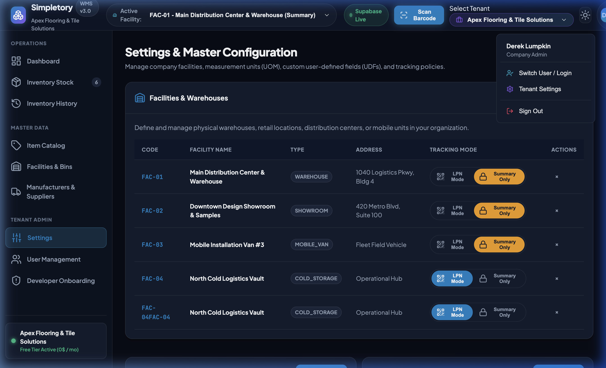
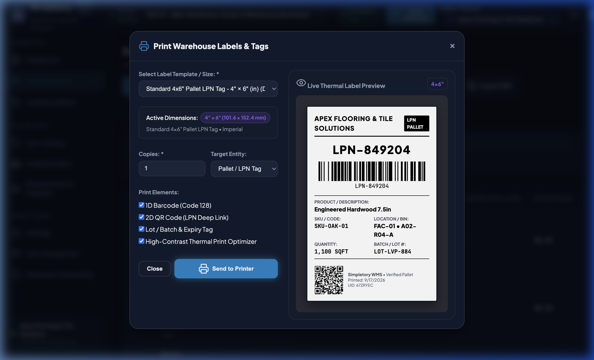
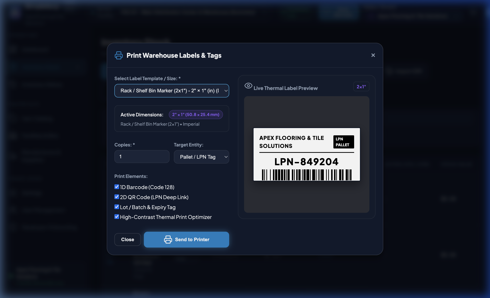
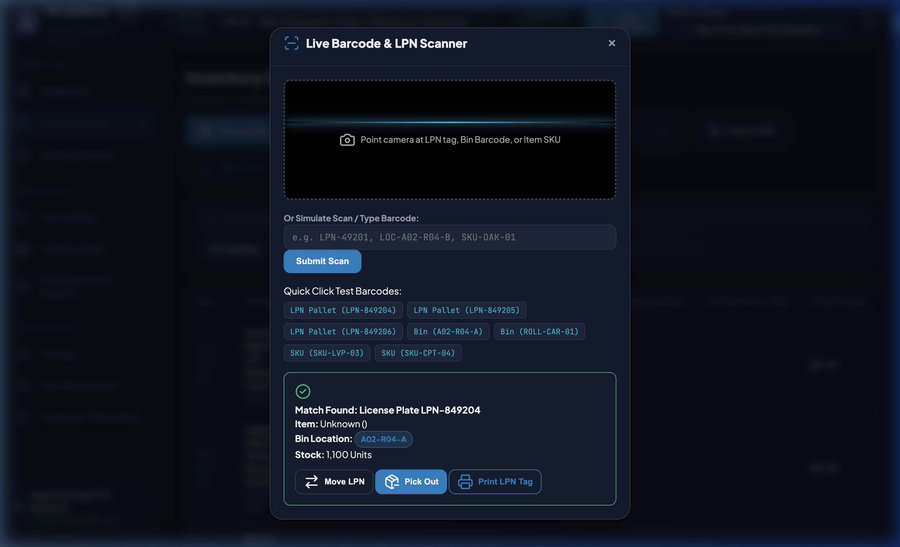
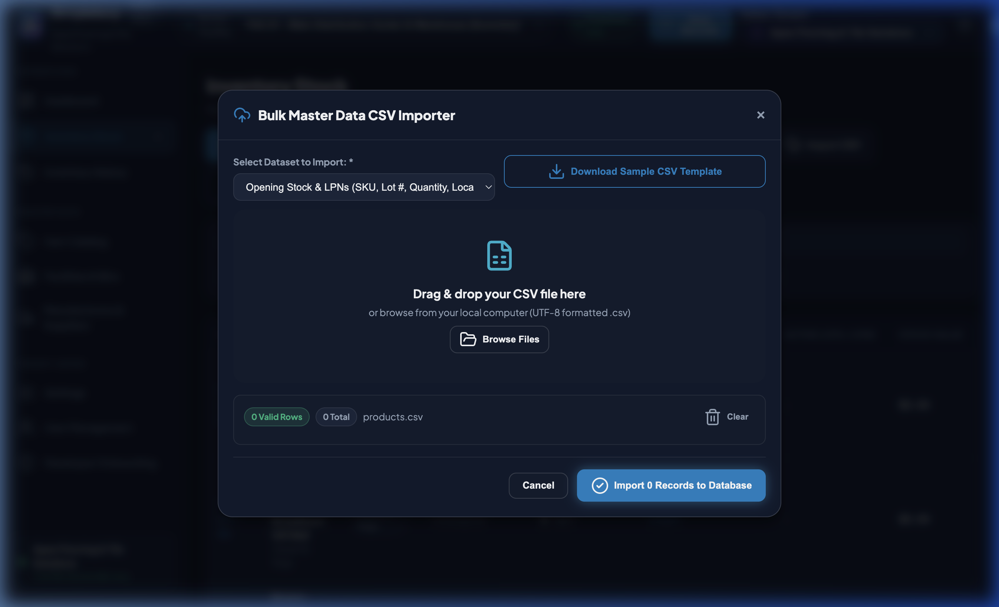
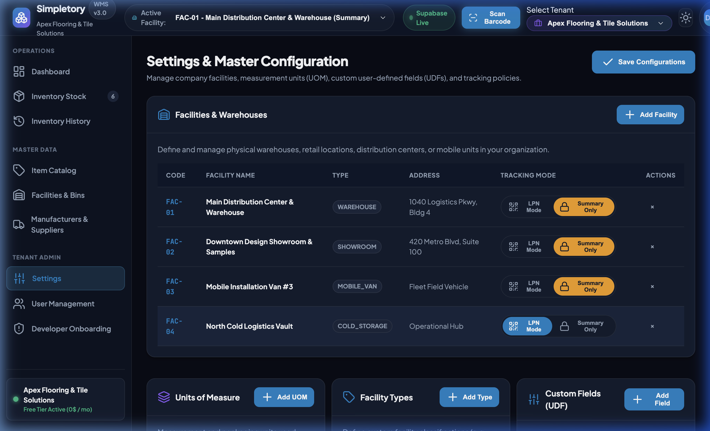

# Simpletory WMS — Operator & Administrator User Guide
**Version 3.0 • Production Ready Edition**

Welcome to **Simpletory WMS**, a modern, multi-tenant warehouse management and inventory platform designed for multi-facility operations, packaging hierarchies, dynamic custom fields (UDFs), and thermal barcode/QR label printing.

---

## Table of Contents
1. [System Overview & Architecture](#1-system-overview--architecture)
2. [Authentication & Dual-Mode Access](#2-authentication--dual-mode-access)
3. [Inbound Receiving & LPN Generation](#3-inbound-receiving--lpn-generation)
4. [Thermal Label Printing Engine](#4-thermal-label-printing-engine)
5. [Interactive Barcode & QR Code Scanner](#5-interactive-barcode--qr-code-scanner)
6. [Inventory Movements & Dispatches](#6-inventory-movements--dispatches)
7. [Bulk Master Data CSV Importer](#7-bulk-master-data-csv-importer)
8. [Settings, Facilities & Custom Fields](#8-settings-facilities--custom-fields)
9. [Role-Based Access Control (RBAC)](#9-role-based-access-control-rbac)

---

## 1. System Overview & Architecture

Simpletory WMS organizes your physical inventory across multiple facilities with two distinct operating modes:
- **LPN Mode (License Plate Tracking)**: Every pallet, crate, or roll receives a unique LPN (e.g. `LPN-849201`) for precision tracking by bin, lot, and status.
- **Summary Mode**: Simplified aggregate balance tracking ideal for small retail showrooms or mobile fleet installation vans.

---

## 2. Authentication & Dual-Mode Access

Simpletory supports two login methods tailored for real-world warehouse operations:
1. **Tenant Administrators**: Invited and authenticated via **Corporate Email & Password**.
2. **Floor Operators & Pickers**: Log in using a simple **Username (User ID) & Password** without requiring a corporate email address.

### User Profile & Account Management:
Click your profile badge in the top right corner to:
- 👑 Access **Tenant Settings**
- 🔑 **Change Password** (Self-Service or Admin Reset)
- 🚪 **Sign Out** to secure the workspace

---

## 3. Inbound Receiving & LPN Generation

When containers or delivery trucks arrive at the receiving dock:
1. Click **Receive New Inventory** in the Inventory view or top action strip.
2. Select the **SKU Product**, destination **Facility**, and initial staging **Bin Location**.
3. Enter the received quantity and select the **Packaging Unit** (e.g., *Pallet (60 Boxes)*). The system automatically computes the base units.
4. Fill in dynamic lot tags (e.g., *Dye Lot / Run #*, *Batch Code*).
5. Click **Receive & Generate LPN**. A unique barcode tag is assigned immediately.

---

## 4. Thermal Label Printing Engine

Simpletory features an integrated thermal and laser label printing engine that renders vector **1D Code 128 barcodes** and **2D QR codes**.

### Supported Label Dimensions:
- **4.0" × 6.0"**: Standard Pallet LPN Tag (Zebra / Rollo / Dymo thermal roll)
- **2.0" × 1.0"**: Rack / Shelf Bin Marker
- **3.0" × 1.0"**: Item Carton Barcode Sticker
- **8.5" × 11.0"**: Full Sheet Dispatch & Packing Slip
- **Custom Sizes**: Add any width × height directly in **Settings > Label Configurations**.

### How to Print:
1. Click **Print Labels** or the printer icon on any LPN row or location card.
2. Select your desired **Label Template / Size** and copy count (1–100).
3. Click **Send to Printer**. The system isolates the label canvas and launches the browser print dialog formatted for thermal rolls with zero browser margins (`@page { margin: 0; }`).

---

## 5. Interactive Barcode & QR Code Scanner

Operators on the warehouse floor can scan barcodes using physical handheld lasers, mobile camera scanners, or manual entry.

### Scanning Actions:
- **Scan LPN Pallet Tag**: Displays product details, current bin location, and instant actions (**Move LPN**, **Pick Out**, **Print LPN Tag**).
- **Scan Bin Location Barcode**: Displays bin capacity, zone, and all stored pallets.
- **Scan Item SKU**: Displays total on-hand stock across all facilities with shortcuts to receive or adjust.
- **Audio Feedback**: An audio chime plays upon every successful scan.

---

## 6. Inventory Movements & Dispatches

### Pallet Relocations (Transfers):
1. Click **Transfer / Move LPN**.
2. Select the source LPN and destination facility/bin location.
3. Click **Execute Relocation**. The audit ledger records the user, timestamp, and location delta.

### Dispatch / Job Picking:
1. Click **Dispatch Inventory**.
2. Specify the SKU, quantity, picking location, and destination job reference.
3. Click **Confirm Dispatch** to deduct inventory and write an audit transaction.

---

## 7. Bulk Master Data CSV Importer

Quickly onboard new product catalogs and opening stock balances using the built-in CSV wizard.

### How to Import:
1. Click **Import CSV** on the Inventory or Catalog view.
2. Select the dataset: **Catalog Products & SKUs**, **Opening Stock (LPNs)**, or **Locations**.
3. Click **Download Sample CSV Template** to get a pre-formatted template.
4. Drag and drop your completed `.csv` file into the drop zone.
5. Review the validation table and click **Import Records to Database**.

---

## 8. Settings, Facilities & Custom Fields

### Unified Facilities Table
Manage your warehouse network, showroom branches, and fleet vehicles in one consolidated view.

- Toggle between **LPN Mode** and **Summary Mode** per facility.
- Manage custom facility operating types (*Main DC*, *Showroom*, *Mobile Fleet*, *Cross-Dock*).

### User-Defined Fields (UDFs)
Define custom attributes per tenant (e.g., *Sq Ft per Box*, *Color / Stain*, *Wear Layer*, *OEM Part Number*) without modifying SQL database code.

---

## 9. Role-Based Access Control (RBAC)

| Role | Permissions & Operational Scope |
| :--- | :--- |
| **Company Admin** | Full access to all facilities, settings, team user management, and catalog pricing. |
| **Warehouse Manager** | Inbound receiving, pallet relocations, stock adjustments, and KPI audit reports. |
| **Warehouse Operator** | Barcode scanning, LPN putaway/relocation, picking, and receiving against POs. |
| **Viewer / Auditor** | Read-only visibility into on-hand stock, bin locations, and audit transaction ledgers. |

---

*Simpletory WMS v3.0 is powered by Supabase PostgreSQL with Realtime WebSockets and offline-resilient local caching.*
